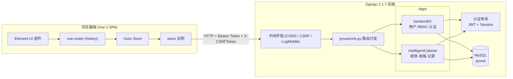
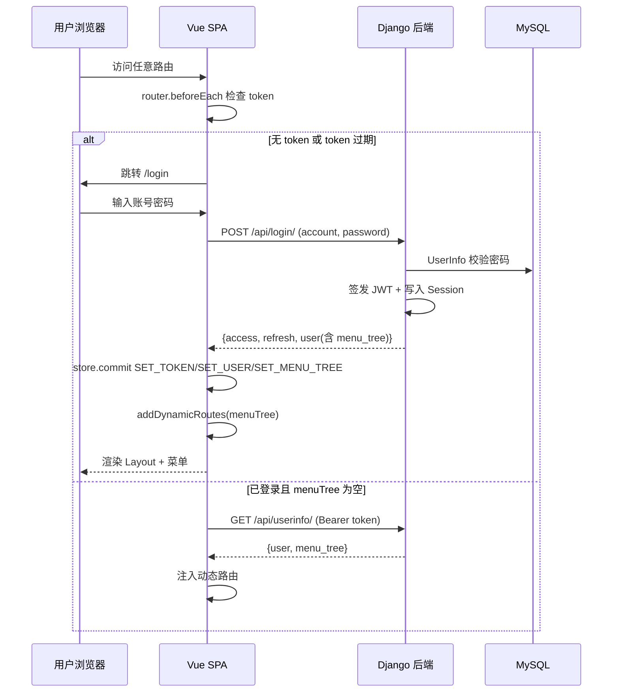
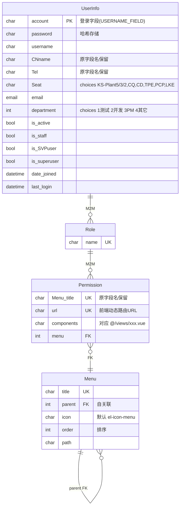
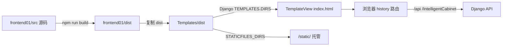
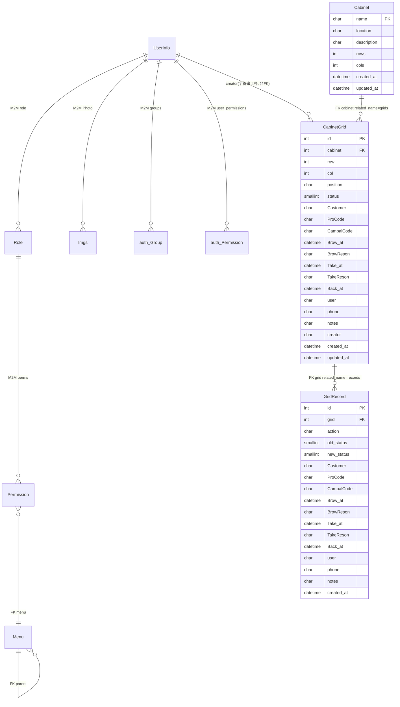

# pyvue 技术维护与开发者指引 (Maintenance & Developer Guide)

> 适用对象：后续开发者、系统维护者、系统拥有者
> 项目名称：pyvue（智能柜 IntelligentCabinet 系统）
> 文档版本：1.0 ｜ 生成日期：2026-08-25
> 文档位置：`docs/MAINTENANCE_GUIDE.md`
> 规则基准：`.trae/rules/project_rules.md`

---

## 目录

1. [项目概述](#1-项目概述)
2. [技术架构总览](#2-技术架构总览)
3. [主程式位置与目录结构](#3-主程式位置与目录结构)
4. [后端核心运作逻辑 (Django + DRF)](#4-后端核心运作逻辑-django--drf)
5. [前端核心运作逻辑 (Vue 2 + Element UI)](#5-前端核心运作逻辑-vue-2--element-ui)
6. [前后端集成与部署](#6-前后端集成与部署)
7. [API 接口契约总览](#7-api-接口契约总览)
8. [数据库设计](#8-数据库设计)
9. [运行与维护命令](#9-运行与维护命令)
10. [维护检查清单 (Checklist)](#10-维护检查清单-checklist)
11. [常见故障排查](#11-常见故障排查)
12. [安全注意事项](#12-安全注意事项)
13. [开发规范要点](#13-开发规范要点)

---

## 1. 项目概述

### 1.1 业务定位

pyvue 是一套**智能柜（IntelligentCabinet）管理系统**，提供：

- **RBAC 权限体系**：用户 / 角色 / 菜单 / 权限四层模型，前端菜单与路由由后端动态下发。
- **智能柜业务**：柜体（Cabinet）→ 柜格（CabinetGrid）→ 操作记录（GridRecord）的状态流转管理，支持预约 / 取消 / 借出 / 归还等业务动作。
- **认证体系**：JWT（simplejwt）+ Session 双重认证；接入阿里云短信验证码。

### 1.2 项目形态

- **前后端分离单体应用**：Django 后端 + Vue 2 前端，但**最终打包集成**为单一 Django 服务。
- **集成方式**：前端 `npm run build` 产出 `dist/`，复制到后端 `Templates/dist/`，由 Django `TemplateView` 承载 `index.html`，静态资源走 `STATICFILES_DIRS`。

### 1.3 技术栈速查

| 层 | 技术 | 版本（关键） |
| --- | --- | --- |
| 后端语言 | Python | **3.7** |
| 后端框架 | Django | **2.1.7** |
| 后端 API | Django REST Framework | 已安装 |
| 认证 | djangorestframework-simplejwt | 已安装 |
| 过滤/分页 | django-filter | 已安装 |
| 跨域 | django-cors-headers | 已安装 |
| 短信 | aliyunsdkcore | 已安装 |
| 数据库 | MySQL | `127.0.0.1:3306`，库名 `pyvue` |
| 前端框架 | Vue | **2.5.2**（Options API） |
| 路由 | vue-router | **3.6.5**（`history` 模式） |
| 状态 | vuex | **3.6.2** |
| UI 库 | element-ui | **2.15.14**（Vue 2 版） |
| HTTP | axios | **0.20.0** |
| 构建工具 | webpack | **3.6.0**（非 4/5） |
| Node 要求 | — | `>= 6.0.0` |

> ⚠️ **铁律**：前端是 **Vue 2**，禁止引入 Vue 3 / Composition API / `<script setup>` / Element Plus / Vite / webpack 5 等不兼容栈。

---

## 2. 技术架构总览

### 2.1 整体架构图



### 2.2 请求/响应关键流（登录 → 动态路由）



### 2.3 关键架构决策

| 决策点 | 当前实现 | 影响与注意 |
| --- | --- | --- |
| 用户模型 | `AUTH_USER_MODEL='backend01.UserInfo'`，继承 `AbstractBaseUser`，登录字段 `account` | **不可更换**为 `auth.User`，否则迁移冲突、数据丢失 |
| 认证策略 | JWT（60 分钟）+ Session（12 小时）双轨 | 前端两套凭证并存；登出需同步清理 |
| 前端路由 | `history` 模式 + 动态路由 `addDynamicRoutes` | 后端需 `re_path(r'^.*$', index.html)` 兜底 |
| 菜单数据 | 后端 `UserInfo.get_menu_tree()` 动态生成 | 修改权限/角色后需用户重新登录或刷新 menuTree |
| 跨域 | `CORS_ORIGIN_ALLOW_ALL=True` + `withCredentials=True` | **生产环境必须收紧** |
| 敏感配置 | `SECRET_KEY` / DB 密码 / 阿里云 AK 硬编码在 `settings.py` | **上线前必须迁出**到环境变量 |

---

## 3. 主程式位置与目录结构

### 3.1 顶层目录

```
pyvue/
├── pyvue/                    # Django 项目配置
│   ├── settings.py           # ★ 主配置（DB/JWT/Session/CORS/LOGGING/REST_FRAMEWORK）
│   ├── urls.py               # ★ 顶层路由分发
│   └── wsgi.py
├── backend01/                # 主后端 app：用户/角色/菜单/权限/认证
│   ├── models.py             # ★ RBAC 模型与 UserInfo
│   ├── serializer.py         # ★ DRF 序列化器
│   ├── views.py              # ★ 登录/注册/用户信息/验证码/Books 视图集
│   ├── backends.py           # 自定义认证后端 CustomUserBackend
│   ├── urls.py               # ★ /api/ 路由
│   └── management/commands/initdata.py  # ★ 初始化数据命令
├── IntelligentCabinet/       # 智能柜业务 app
│   ├── models.py             # ★ Cabinet / CabinetGrid / GridRecord
│   ├── serializer.py         # ★ 柜体/柜格序列化器（含 statusText 派生字段）
│   ├── views.py              # ★ 柜体增删/柜格更新/预约/借出
│   └── urls.py               # ★ /IntelligentCabinet/ 路由
├── middleware/
│   └── UserIP.py              # ★ LogMiddle：请求日志/IP 中间件
├── Templates/dist/           # ★ 前端打包产物（生产由 Django 托管）
├── frontend01/               # Vue 前端源码
│   ├── src/
│   │   ├── main.js           # ★ Vue 入口
│   │   ├── App.vue
│   │   ├── router/router.js  # ★ 静态路由 + addDynamicRoutes + beforeEach
│   │   ├── store/
│   │   │   ├── index.js      # ★ Vuex 根（token/user/menuTree）
│   │   │   └── modules/cabinet.js
│   │   ├── utils/request.js  # ★ axios 实例 + 拦截器
│   │   ├── api/              # ★ 请求函数（user.js / cabinet.js）
│   │   ├── layout/           # 布局组件（菜单顶/左切换）
│   │   └── views/            # 页面级 .vue
│   ├── build/                # webpack 3 配置
│   ├── config/               # dev/prod 环境配置
│   ├── vue.config.js         # ★ devServer + 代理
│   └── package.json
├── logs/                     # 滚动日志（all/error/info）
├── manage.py                 # ★ Django 入口
├── db.sqlite3                # 已注释，**当前以 MySQL 为准**
└── .trae/rules/project_rules.md  # 项目规则基准
```

### 3.2 "主程式"清单（核心入口与配置）

| 角色 | 文件路径 | 用途 |
| --- | --- | --- |
| Django 入口 | `manage.py` | 启动 runserver / 迁移 / 自定义命令 |
| Django 配置 | `pyvue/settings.py` | 所有运行时配置 |
| 顶层路由 | `pyvue/urls.py` | 分发 `/api/`、`/IntelligentCabinet/`、前端兜底 |
| RBAC 模型 | `backend01/models.py` | Menu/Permission/Role/UserInfo + `get_menu_tree()` |
| 认证视图 | `backend01/views.py` | LoginView/LogoutView/UserInfoView/验证码/注册/重置密码 |
| 认证后端 | `backend01/backends.py` | `CustomUserBackend.authenticate(account, password)` |
| 柜业务模型 | `IntelligentCabinet/models.py` | Cabinet/CabinetGrid/GridRecord |
| 柜业务视图 | `IntelligentCabinet/views.py` | 柜体增删/柜格更新/预约/借出 |
| 日志中间件 | `middleware/UserIP.py` | `LogMiddle` 记录请求/IP |
| Vue 入口 | `frontend01/src/main.js` | 注册 router/store/ElementUI |
| 前端路由 | `frontend01/src/router/router.js` | 静态路由 + 动态路由 + 鉴权 |
| Vuex | `frontend01/src/store/index.js` | 认证状态 + localStorage 持久化 |
| axios | `frontend01/src/utils/request.js` | 请求/响应拦截器 |
| 前端构建代理 | `frontend01/vue.config.js` | devServer 代理 `/api` → 8000 |

---

## 4. 后端核心运作逻辑 (Django + DRF)

### 4.1 模型层 (backend01/models.py)

#### 4.1.1 RBAC 四件套



**关键约束**：
- `UserInfo` 继承 `AbstractBaseUser`（**不是** `AbstractUser`），登录字段 `account`，`REQUIRED_FIELDS=['email','username']`。
- 用户管理器 `UserInfoManager(BaseUserManager)` 提供 `create_user` / `create_superuser` / `get_by_natural_key`。
- `Permission.url` 是**前端动态路由 URL**，**不得**与后端真实 API 路径重复（注释明确警告）。
- `Permission.components` 决定前端跳转的 `.vue` 文件（懒加载 `() => import('@/views/${item.component}.vue')`）。

#### 4.1.2 `UserInfo.get_menu_tree()` —— 后端权限下发的核心

调用链：`/api/login/` 或 `/api/userinfo/` → `UserInfoSerializer.get_menu_tree()` → `UserInfo.get_menu_tree()`。

逻辑要点：
1. 查询用户所有 `Role` 关联的 `Permission`（`distinct()`）。
2. 收集权限对应的菜单及其**所有祖先菜单**（保证菜单层级完整）。
3. 递归 `build_tree(menu_id)` 构造嵌套结构，每个节点含 `id/title/icon/path/component/children`。
4. 叶子节点的 `path` 取权限的 `url`，`component` 取权限的 `components`。
5. 按 `order` 排序子节点。

> 🔎 调试 tip：`get_menu_tree()` 末尾有 `print(menu_tree)`，登录时会输出到后端控制台。

#### 4.1.3 智能柜模型 (IntelligentCabinet/models.py)

| 模型 | 关键字段 | 约束 |
| --- | --- | --- |
| `Cabinet` | name(UK)、location、rows、cols、created_at、updated_at | `ordering=['-created_at']` |
| `CabinetGrid` | cabinet FK(related_name=`grids`)、row、col、position、status(0/1/2/3)、Customer/ProCode/CampalCode、Brow_at/Take_at/Back_at、user、phone、notes、creator | `unique_together=('cabinet','position')`、`ordering=['cabinet','row','col']` |
| `GridRecord` | grid FK(related_name=`records`)、action(create/update/reserve/use/release/keep)、old_status、new_status、+ 业务字段快照 | `ordering=['-created_at']` |

**状态枚举**（`CabinetGrid.STATUS_CHOICES`）：
- `0` 空闲｜`1` 使用中｜`2` 预定中｜`3` 拿取保留中

> ⚠️ `GridRecord.action` 注释列出了 6 种动作，但视图 `ConfirmBorrowView` 实际写入的是 `'borrow'`（不在 choices 内），属已知偏差，维护时注意。

### 4.2 序列化器层 (serializer.py)

#### 4.2.1 backend01

| 序列化器 | 用途 | 关键点 |
| --- | --- | --- |
| `MenuTreeSerializer` | 手动序列化菜单树 | 字段 `id/title/icon/path/children` |
| `PermissionSerializer` | 权限 | **保留原字段名** `Menu_title`、`url` |
| `RoleSerializer` | 角色 | 嵌套 `perms` |
| `UserInfoSerializer` | 用户（含菜单树） | `fields` 显式枚举大写字段 `CNname/Tel/Photo`；`menu_tree=SerializerMethodField`；`password` `write_only` |

#### 4.2.2 IntelligentCabinet

| 序列化器 | 关键点 |
| --- | --- |
| `CabinetSerializer` | `fields='__all__'`，`id` read_only |
| `CabinetGridUpdateSerializer` | `cabinet` 为 `PrimaryKeyRelatedField`；`row/col/id` read_only（创建后不可改） |
| `CabinetCreateSerializer` | 含 `gridData` 二维数组；`validate` 校验名称唯一、行列匹配、位置格式（字母+数字）；`create` 批量 `bulk_create` 柜格 |
| `CabinetGridSerializer` | 嵌套 `CabinetSerializer`；派生字段 `statusText=SerializerMethodField`（自动映射 `STATUS_CHOICES`） |
| `GridRecordSerializer` | 嵌套柜格序列化器（注意：`menu_tree` 字段为遗留代码，模型无对应字段） |

### 4.3 视图层

#### 4.3.1 backend01/views.py 视图清单

| 视图类 | URL | 方法 | 认证/权限 | 职责 |
| --- | --- | --- | --- | --- |
| `LoginView` | `/api/login/` | GET/POST | `authentication_classes=[]` `permission_classes=[]` | 校验密码→签发 JWT→写 Session→返回 access/refresh/user(含 menu_tree) |
| `LogoutView` | `/api/logout/` | POST | `IsAuthenticated` | `django.contrib.auth.logout` 清 Session |
| `UserInfoView` | `/api/userinfo/` | GET | `JWTAuthentication` + `IsAuthenticated` | 返回当前用户信息 + menu_tree |
| `SendVerificationCodeView` | `/api/send_verification_code/` | POST | `csrf_exempt` | 6 位随机码入 cache(5min) + 阿里云短信 |
| `RegisterView` | `/api/register/` | POST | `csrf_exempt` | 校验验证码→创建 `UserInfo`(account=phone) |
| `ResetPasswordView` | `/api/reset_password/` | POST | `csrf_exempt` | 按手机号重置密码（注释提示需校验 token） |
| `BooksViewSet` | `/api/books/` (Router) | CRUD | 默认 IsAuthenticated | 演示用，含分页/过滤/搜索/排序 |
| `CustomJsonRender` | — | — | — | 统一响应包装 `{code,msg,data}`（仅 Books 使用） |

**登录关键逻辑**（`LoginView.post`）：
- 校验 `account` + `check_password` + `is_active`。
- `RefreshToken.for_user(user)` 签发 JWT。
- 写入 Session：`is_login_pyvue` / `user_id_pyvue` / `user_name_pyvue` / `CNname_pyvue` / `account_pyvue` / `access_pyvue`。
- `request.session.set_expiry(5*12*60*60)` = 12 小时。
- 响应：`{access, refresh, user: UserInfoSerializer(user).data}`。

#### 4.3.2 IntelligentCabinet/views.py 视图清单

| 视图类 | URL | 方法 | 职责要点 |
| --- | --- | --- | --- |
| `CabinetListView` | `/IntelligentCabinet/cabinets/` | GET/POST | GET 列表；POST 创建柜体+批量柜格（事务 `transaction.atomic`），返回 `isAdmin/currentUser/CustomerOptions` |
| `CabinetDetailView` | `/IntelligentCabinet/cabinets/<int:pk>/` | DELETE | 存在非空闲柜格则拒绝删除 |
| `GridUpdateView` | `/IntelligentCabinet/grids/<int:pk>/update/` | PATCH | 管理员更新柜格，写 `GridRecord(action='update')` |
| `UserReserveView` | `/IntelligentCabinet/grids/<int:pk>/reserve/` | POST | 用户预约，`user` 自动取 session `account_pyvue` |
| `UserCancelReserveView` | `/IntelligentCabinet/grids/<int:pk>/cancel-reserve/` | POST | 重置柜格为空闲 |
| `ConfirmBorrowView` | `/IntelligentCabinet/grids/<int:pk>/confirm-borrow/` | POST | 管理员确认借出，写 `GridRecord(action='borrow')` |
| `CabinetGridListView` | `/IntelligentCabinet/init-data/` | GET | 前端初始化数据：所有柜体+柜格二维数组+isAdmin+currentUser+CustomerOptions |

**权限判断**：业务视图通过 session `account_pyvue` 查 `UserInfo.role`，判断是否含 `管理员` 或 `CabinetManageAdmin` 角色。**注意**：视图未全局加 `IsAuthenticated`（依赖默认配置），生产环境建议显式声明。

### 4.4 路由层

#### 4.4.1 顶层 pyvue/urls.py

```python
urlpatterns = [
    path('admin/', admin.site.urls),
    path('api/', include('backend01.urls')),
    path('IntelligentCabinet/', include('IntelligentCabinet.urls')),
]
if settings.DEBUG:
    urlpatterns += static(settings.MEDIA_URL, document_root=settings.MEDIA_ROOT)
urlpatterns += [
    path('', TemplateView.as_view(template_name='index.html')),
    re_path(r'^.*$', TemplateView.as_view(template_name='index.html')),  # 前端 history 兜底
]
```

#### 4.4.2 backend01/urls.py

```python
router = DefaultRouter()
router.register('books', views.BooksViewSet)
urlpatterns = [
    path('login/', ...),
    path('send_verification_code/', ...),
    path('register/', ...),
    path('reset_password/', ...),
    path('logout/', ...),
    path('userinfo/', ...),
    path('', include(router.urls)),
]
```

#### 4.4.3 IntelligentCabinet/urls.py

```python
app_name = 'IntelligentCabinet'
urlpatterns = [
    path('cabinets/', CabinetListView.as_view()),
    path('cabinets/<int:pk>/', CabinetDetailView.as_view()),
    path('grids/<int:pk>/update/', GridUpdateView.as_view()),
    path('grids/<int:pk>/reserve/', UserReserveView.as_view()),
    path('grids/<int:pk>/cancel-reserve/', UserCancelReserveView.as_view()),
    path('grids/<int:pk>/confirm-borrow/', ConfirmBorrowView.as_view()),
    path('init-data/', CabinetGridListView.as_view()),
]
```

> 规则：URL **末尾统一带斜杠**（`APPEND_SLASH`）；资源路径用 `<int:pk>`。

### 4.5 认证与权限

#### 4.5.1 全局 DRF 配置 (settings.py)

```python
REST_FRAMEWORK = {
    'DEFAULT_AUTHENTICATION_CLASSES': [
        'rest_framework.authentication.SessionAuthentication',
        'rest_framework_simplejwt.authentication.JWTAuthentication',
    ],
    'DEFAULT_PERMISSION_CLASSES': [
        'rest_framework.permissions.IsAuthenticated',
    ],
}
SIMPLE_JWT = {
    'ACCESS_TOKEN_LIFETIME': timedelta(minutes=60),
    'REFRESH_TOKEN_LIFETIME': timedelta(days=7),
    'ROTATE_REFRESH_TOKENS': True,
    'BLACKLIST_AFTER_ROTATION': True,
    'UPDATE_LAST_LOGIN': True,
    'AUTH_HEADER_TYPES': ('Bearer',),
}
AUTHENTICATION_BACKENDS = [
    'backend01.backends.CustomUserBackend',
    'django.contrib.auth.backends.ModelBackend',
]
AUTH_USER_MODEL = 'backend01.UserInfo'
```

#### 4.5.2 Session 配置

| 项 | 值 |
| --- | --- |
| `SESSION_ENGINE` | `django.contrib.sessions.backends.db` |
| `SESSION_SERIALIZER` | `PickleSerializer`（注释说明：否则复杂结构报错） |
| `SESSION_SAVE_EVERY_REQUEST` | `True` |
| `SESSION_COOKIE_AGE` | `5*12*60*60`（12 小时） |
| `SESSION_EXPIRE_AT_BROWSER_CLOSE` | `False` |
| Cookie 安全 | `SAMESITE=Lax` / `SECURE=False`（本地）/ `HTTPONLY=True` |

#### 4.5.3 前端请求头约定

- `Authorization: Bearer <access_token>`（登录接口除外）
- `X-CSRFToken: Cookies.get('csrftoken')`（非 GET 方法必带）
- `withCredentials: true`（携带 Cookie）

### 4.6 中间件与日志

#### 4.6.1 中间件链（settings.MIDDLEWARE）

```
SecurityMiddleware
SessionMiddleware
CorsMiddleware                  ← 跨域，须靠前
CommonMiddleware
CsrfViewMiddleware
AuthenticationMiddleware
MessageMiddleware
XFrameOptionsMiddleware
middleware.UserIP.LogMiddle      ← 自定义请求日志
```

#### 4.6.2 LogMiddle (middleware/UserIP.py)

- `process_request`：记录 `request.init_time`。
- `process_response`：仅对 **POST** 请求记录（GET 返回 HTML 会 `json.loads` 失败）；解析 `HTTP_X_FORWARDED_FOR` / `REMOTE_ADDR`；输出格式：
  ```
  {时间}: {Account}/{request.user}/{username}> {CLIENTNAME}/{COMPUTERNAME}/{USERNAME} > {ip}/{proxy_ip} > {request}
  ```
- logger：`logging.getLogger('log')`。

#### 4.6.3 日志配置 (settings.LOGGING)

| Handler | 文件 | level | 大小/备份 |
| --- | --- | --- | --- |
| `default` | `logs/all-YYYY-MM-DD.log` | DEBUG | 5MB × 5 |
| `error` | `logs/error-YYYY-MM-DD.log` | ERROR | 5MB × 5 |
| `info` | `logs/info-YYYY-MM-DD.log` | INFO | 5MB × 5 |
| `console` | 控制台 | DEBUG | — |

Logger：
- `'django'` → `default+console+error`，level INFO
- `'log'` → `error+info+console+default`，level INFO，propagate=True

### 4.7 自定义命令

| 命令 | 路径 | 作用 |
| --- | --- | --- |
| `python manage.py initdata` | `backend01/management/commands/initdata.py` | 初始化菜单（系统管理→用户/角色管理）、权限、管理员角色、管理员用户 `edwin / DCT@2019` |

**initdata 注意**：
- 若 `Menu.objects.exists()` 则跳过（幂等保护）。
- 默认管理员：`account='edwin'`, `password='DCT@2019'`, `is_staff=True`, `is_superuser=True`。
- ⚠️ 默认密码硬编码，**生产环境务必修改**。

---

## 5. 前端核心运作逻辑 (Vue 2 + Element UI)

### 5.1 应用入口 (src/main.js)

```javascript
import Vue from 'vue'
import App from './App.vue'
import router from './router/router'
import store from './store'
import 'core-js/stable'
import ElementUI from 'element-ui'
import 'element-ui/lib/theme-chalk/index.css'
Vue.use(ElementUI)
new Vue({ router, store, render: h => h(App) }).$mount('#app')
```

- 全量注册 Element UI（Vue 2 版）。
- 不使用 Vuex 持久化插件全局接入，认证信息手动写入 `localStorage`。

### 5.2 路由系统 (src/router/router.js)

#### 5.2.1 静态路由表

| path | 组件 | hidden | meta |
| --- | --- | --- | --- |
| `/login` | `Login.vue` | true | — |
| `/404` | `404.vue` | true | — |
| `/route-loading` | `RouteLoading.vue` | true | — |
| `/register` | `Register.vue` | true | `anonymous:true` |
| `/forgot-password` | `ForgotPassword.vue` | true | `anonymous:true` |
| `/reset-password` | `ResetPassword.vue` | true | `anonymous:true` |

> 注释中存在 `path:'*'` redirect 到 `/404` 的方案，但**未启用**（因会导致刷新跳 404）。

#### 5.2.2 动态路由注入 `addDynamicRoutes(menuTree)`

```mermaid
flowchart TD
    A[addDynamicRoutes menuTree] --> B[移除旧 Wildcard 路由]
    B --> C[构造 layoutRoute<br/>path='/' redirect='/dashboard'<br/>children 含 Dashboard]
    C --> D[addRoutes 递归 menuTree]
    D --> E{节点有 children?}
    E -- 是 --> F[创建 Menu_ 路由<br/>顶层用 NestedContainer.vue<br/>子层 component=null]
    E -- 否且 path 存在 --> G[创建 Page_ 叶子路由<br/>component = () => import<br/>'@/views/{item.component}.vue']
    F --> D
    G --> H[addRoute layoutRoute]
    H --> I[addRoute 通配 *→404<br/>name=Wildcard]
```

**关键点**：
- `() => import('@/views/${item.component || 'EmptyPage'}.vue')` 懒加载，`item.component` 来自后端 `Permission.components`。
- `routeExists(name)` 辅助判断，重复 addRoute 前先 `removeRoute('Layout')` 与 `removeRoute('Wildcard')`。
- 调用时机：登录成功后、`router.beforeEach` 中 menuTree 为空时。

#### 5.2.3 `router.beforeEach` 鉴权流程

```
1. noAuthPages = ['/login','/404','/route-loading','/register','/forgot-password','/reset-password'] → 直接放行
2. checkTokenExpiration()：解析 JWT payload.exp，过期则返回 true
3. 无 token 或过期 → 清 localStorage(token/user/menuTree) + 重置 store → 跳 /login
4. menuTree 为空：
   4.1 先读 localStorage.menuTree，有则 SET_MENU_TREE + addDynamicRoutes + next(to.path)
   4.2 否则 dispatch('fetchUserInfo') → addDynamicRoutes
5. 恢复 store.user（若空但 localStorage.user 存在）
6. to.meta.anonymous → 放行
7. to.matched.length === 0 → 跳 /404
8. next()
```

> ⚠️ 已知坑：`request.js` 的 403 拦截器引用了未定义的 `response` 与 `store`/`router`（局部未导入），实际仅 401 分支能正常跳转，403 分支会抛 ReferenceError。维护时优先靠 `beforeEach` 的 token 过期检查兜底。

### 5.3 状态管理 (src/store/index.js)

#### 5.3.1 State

| 字段 | 初始值 | 持久化 |
| --- | --- | --- |
| `token` | `localStorage.getItem('token') \|\| ''` | localStorage |
| `user` | `JSON.parse(localStorage.getItem('user') \|\| 'null')` | localStorage |
| `menuTree` | `[]` | localStorage（在 mutation 内写入） |
| `isCollapse` | `false` | — |
| `menuPosition` | `'left'` | — |
| `routeLoading` | `false` | — |

#### 5.3.2 关键 Mutations

- `SET_TOKEN` / `SET_USER` / `SET_MENU_TREE`：同步写入 localStorage。
- `TOGGLE_COLLAPSE` / `SET_COLLAPSE` / `SET_MENU_POSITION` / `SET_ROUTE_LOADING`：UI 状态。
- `LOGOUT`：清空全部认证 + UI 状态 + localStorage（token/menuTree/user）。

#### 5.3.3 关键 Actions

- `login({token, user})`：连续三次 commit（token / user / menu_tree）。
- `fetchUserInfo()`：`request.get('/api/userinfo/')` → SET_USER + SET_MENU_TREE + localStorage。
- `logout()` / `toggleCollapse()` / `setCollapse()` / `setMenuPosition()` / `setRouteLoading()` / `setUser()`。

#### 5.3.4 模块

- `modules/cabinet.js`：智能柜业务状态（按需查阅）。

### 5.4 请求层 (src/utils/request.js)

```javascript
const service = axios.create({
  baseURL: 'http://127.0.0.1:8000',
  withCredentials: true,
  timeout: 5000
})
```

- **请求拦截器**：`/login/` 结尾跳过；否则注入 `Authorization: Bearer <token>`。
- **响应拦截器**：
  - 401 或 message 含 `401/Unauthorized` → `redirectToLogin()`（清 token/menuTree，跳 `/login`）。
  - 403 → 尝试判断 token 过期（**有缺陷**，见 5.2.3 注意）。

> 注释说明：`localhost` 在部分浏览器被视为敏感域，跨域 Cookie 可能被拦；统一使用 `127.0.0.1`。

### 5.5 API 函数清单

#### 5.5.1 src/api/user.js

| 函数 | URL | 方法 | CSRF |
| --- | --- | --- | --- |
| `login(data)` | `/api/login/` | POST | 否 |
| `send_verification_code(data)` | `/api/send_verification_code/` | POST | 是 |
| `register(data)` | `/api/register/` | POST | 是 |
| `reset_password(data)` | `/api/reset_password/` | POST | 是 |
| `logout()` | `/api/reset_password/` ⚠️ | POST | 否 |
| `getUserInfo()` | `/api/userinfo/` | GET | 否 |

> ⚠️ `logout()` 实际指向 `/api/reset_password/`，与后端 `LogoutView` 的 `/api/logout/` **不匹配**，属遗留 bug，维护时注意。

#### 5.5.2 src/api/cabinet.js

| 函数 | URL | 方法 |
| --- | --- | --- |
| `getCabinetData(params)` | `/IntelligentCabinet/init-data/` | GET |
| `addCabinetAction(data)` | `/IntelligentCabinet/cabinets/` | POST |
| `deleteCabinetAction(cabinetId)` | `/IntelligentCabinet/cabinets/{id}/` | DELETE |
| `updateGrid(cabinet, data)` | `/IntelligentCabinet/grids/{id}/update/` | PATCH |
| `reserveCell(gridId, data)` | `/IntelligentCabinet/grids/{id}/reserve/` | POST |
| `cancelReservation(gridId, data)` | `/IntelligentCabinet/grids/{id}/cancel-reserve/` | POST |
| `confirmBorrow(gridId, data)` | `/IntelligentCabinet/grids/{id}/confirm-borrow/` | POST |
| `getCabinets()` | 兼容旧代码 | GET |

所有非 GET 请求注入 `X-CSRFToken: Cookies.get('csrftoken')`。

### 5.6 布局与视图

#### 5.6.1 布局 (src/layout/)

- `index.vue`：主布局，支持**顶部菜单 / 左侧菜单**切换（受 `menuPosition` 控制），渲染 `menuTree`，含 Breadcrumb、AppMain、RouteLoading、用户菜单（注销）。
- `AppMain.vue`：路由出口 `<router-view>` 容器。
- `Breadcrumb.vue`：面包屑。
- 备份文件：`index202508251610.vue` / `index202508261500.vue` 等为历史快照，**勿改**。

#### 5.6.2 主要页面 (src/views/)

| 文件 | 职责 |
| --- | --- |
| `Login.vue` | 登录页，成功后 `store.dispatch('login')` + `addDynamicRoutes(menuTree)` |
| `Register.vue` / `ForgotPassword.vue` / `ResetPassword.vue` | 注册/找回/重置 |
| `Dashboard.vue` | 控制面板（动态路由默认 redirect 目标） |
| `EmptyPage.vue` | 后端 `Permission.components` 缺失时的兜底 |
| `NestedContainer.vue` | 多级菜单嵌套容器 |
| `RouteLoading.vue` | 路由加载中转页 |
| `404.vue` | 未匹配兜底 |
| `IntelligentCabinet/SmartCabinet.vue` | 智能柜主业务页面 |
| `About.vue` / `Home.vue` | 辅助页 |

### 5.7 构建与运行

#### 5.7.1 vue.config.js（devServer 代理）

```javascript
devServer: {
  headers: { Host: 'localhost:8000' },
  proxy: {
    '/api': { target: 'http://localhost:8000', changeOrigin: true, ... },
    '**': { target: 'http://localhost:8000', bypass: 静态资源跳过 }
  }
}
```

#### 5.7.2 package.json scripts

- `npm run dev` → `webpack-dev-server --inline --progress --config build/webpack.dev.conf.js`
- `npm run build` → `node build/build.js`
- `npm start` → `npm run dev`

#### 5.7.3 webpack 配置位置

- `build/webpack.base.conf.js` / `webpack.dev.conf.js` / `webpack.prod.conf.js`
- 别名 `@ → src`（webpack `resolve.alias`）。

---

## 6. 前后端集成与部署

### 6.1 集成流程



### 6.2 关键配置 (settings.py)

```python
TEMPLATES = [{'DIRS': [os.path.join(BASE_DIR, 'Templates', 'dist')], ...}]
STATICFILES_DIRS = [os.path.join(BASE_DIR, 'Templates/dist/static')]
STATIC_ROOT = os.path.join(BASE_DIR, 'staticfiles')  # collectstatic 目标
MEDIA_URL = '/media_pyvue/'
MEDIA_ROOT = os.path.join(BASE_DIR, 'media_pyvue')
```

### 6.3 部署步骤

1. **后端依赖**：Python 3.7 + Django 2.1.7 + DRF + simplejwt + django-filter + corsheaders + aliyunsdkcore + MySQL 驱动（mysqlclient/PyMySQL，须兼容 Py3.7）。
2. **数据库**：MySQL 创建库 `pyvue`，账号 `edwin / DCT@2019`（生产改用强密码 + 环境变量）。
3. **迁移**：`python manage.py makemigrations && python manage.py migrate`。
4. **初始化数据**：`python manage.py initdata`（首次创建菜单/角色/管理员）。
5. **前端打包**：`cd frontend01 && npm install && npm run build`。
6. **复制产物**：将 `frontend01/dist/` 整体复制到 `Templates/dist/`。
7. **静态收集**（可选）：`python manage.py collectstatic`。
8. **启动**：`python manage.py runserver 0.0.0.0:8000`。

### 6.4 开发联调

- 前端 `npm run dev`（端口 8080）→ devServer 代理 `/api`、`/IntelligentCabinet` 到 `http://localhost:8000`。
- 后端 `python manage.py runserver`（端口 8000）。
- CORS：开发环境 `CORS_ORIGIN_ALLOW_ALL=True` + `CORS_ALLOW_CREDENTIALS=True`。
- 前端使用 `127.0.0.1:8000` 作为 baseURL（避免 localhost 跨域 Cookie 问题）。

---

## 7. API 接口契约总览

### 7.1 前缀约定

| 前缀 | app | 业务 |
| --- | --- | --- |
| `/api/...` | backend01 | 用户/认证/RBAC/Books |
| `/IntelligentCabinet/...` | IntelligentCabinet | 柜体/柜格/记录 |
| `/admin/` | Django Admin | 后台管理 |
| `/media_pyvue/...` | — | 媒体文件（DEBUG 模式） |

### 7.2 认证接口

| 接口 | 方法 | 请求体 | 响应要点 |
| --- | --- | --- | --- |
| `/api/login/` | POST | `{account, password}` | `{access, refresh, user(含 menu_tree)}` 或 401 |
| `/api/logout/` | POST | — | `{message}` |
| `/api/userinfo/` | GET | — | `UserInfoSerializer.data`（含 menu_tree） |
| `/api/send_verification_code/` | POST | `{phone, type?}` | `{message}` 或 400/500 |
| `/api/register/` | POST | `{phone, code, password}` | `{message}` 或 400 |
| `/api/reset_password/` | POST | `{phone, token, new_password}` | `{message}` 或 400 |

### 7.3 智能柜接口

| 接口 | 方法 | 说明 |
| --- | --- | --- |
| `/IntelligentCabinet/init-data/` | GET | 前端初始化，返回柜体+二维柜格+isAdmin+currentUser+CustomerOptions |
| `/IntelligentCabinet/cabinets/` | GET/POST | 列表 / 创建（含 gridData 二维数组） |
| `/IntelligentCabinet/cabinets/<pk>/` | DELETE | 删除（存在非空闲柜格则拒绝） |
| `/IntelligentCabinet/grids/<pk>/update/` | PATCH | 管理员更新柜格 |
| `/IntelligentCabinet/grids/<pk>/reserve/` | POST | 用户预约 |
| `/IntelligentCabinet/grids/<pk>/cancel-reserve/` | POST | 取消预约 |
| `/IntelligentCabinet/grids/<pk>/confirm-borrow/` | POST | 确认借出 |

### 7.4 字段命名一致性（铁律）

**严禁改名**以下既有字段（前后端契约锁定）：

- backend01：`CNname` / `Tel` / `Photo` / `Menu_title` / `perms`
- IntelligentCabinet：`Customer` / `ProCode` / `CampalCode` / `Brow_at` / `Take_at` / `Back_at` / `BrowReson` / `TakeReson` / `statusText`（派生）

### 7.5 错误处理约定

- 后端查询异常必须 `try/except`，记录日志并返回合适 HTTP 状态码（401/403/404/400/500）。
- `CabinetListView.post` 对错误返回统一结构 `{errMsg, cabinets, isAdmin, currentUser, CustomerOptions}`，**部分错误未设 4xx 状态码**（前端依赖 errMsg 字段判断），维护时保持一致。

---

## 8. 数据库设计

### 8.1 ER 图（完整）



### 8.2 迁移历史

| App | 迁移文件 |
| --- | --- |
| backend01 | `0001_initial` / `0002_auto_20250815_1518` / `0003_auto_20250818_1451` / `0004_permission_components` |
| IntelligentCabinet | `0001_initial` / `0002_auto_20250829_1517` |

> 迁移规则：改模型后必须 `makemigrations && migrate`；**不可更换 `AUTH_USER_MODEL`**（生产数据丢失）。

---

## 9. 运行与维护命令

| 操作 | 命令 | 工作目录 |
| --- | --- | --- |
| 后端启动 | `python manage.py runserver 0.0.0.0:8000` | 项目根 `pyvue/` |
| 前端开发 | `cd frontend01 && npm run dev` | 端口 8080 |
| 前端打包 | `cd frontend01 && npm run build` | 产物 `frontend01/dist/` |
| 复制前端产物 | 手动复制 `frontend01/dist/` → `Templates/dist/` | 项目根 |
| 数据库迁移 | `python manage.py makemigrations && python manage.py migrate` | 项目根 |
| 创建超级用户 | `python manage.py createsuperuser`（用 `account` 登录） | 项目根 |
| 初始化数据 | `python manage.py initdata` | 项目根 |
| 收集静态文件 | `python manage.py collectstatic`（生产） | 项目根 |
| 进入 Django shell | `python manage.py shell` | 项目根 |

---

## 10. 维护检查清单 (Checklist)

### 10.1 日常运维检查

- [ ] `logs/` 目录是否有过期日志堆积（按天滚动，备份数 5，超出应清理）。
- [ ] MySQL `pyvue` 库连接是否正常，`django_session` 表是否膨胀（`SESSION_SAVE_EVERY_REQUEST=True` 会快速增加 session 行）。
- [ ] 后端控制台是否有 `get_menu_tree()` 的 `print` 输出泄露（生产应移除）。
- [ ] 前端 `Templates/dist/` 与最新 `frontend01/dist/` 是否一致（每次发版必须同步）。
- [ ] 阿里云短信余额/签名/模板是否有效（`ALIYUN_*` 配置当前为占位符，生产需替换）。

### 10.2 安全检查

- [ ] **`SECRET_KEY` 是否仍硬编码**（`settings.py` 第 114 行）→ 必须迁出。
- [ ] **数据库密码是否仍为 `DCT@2019`** → 生产改强密码 + 环境变量。
- [ ] `DEBUG=True` 是否在生产关闭（当前为 True）。
- [ ] `ALLOWED_HOSTS=['*']` 是否收紧为实际域名。
- [ ] `CORS_ORIGIN_ALLOW_ALL=True` 是否关闭，改用 `CORS_ALLOWED_ORIGINS` 白名单。
- [ ] `SESSION_COOKIE_SECURE` 是否设为 True（生产 HTTPS）。
- [ ] `initdata` 默认管理员 `edwin / DCT@2019` 是否已修改密码。
- [ ] CSRF_TRUSTED_ORIGINS 是否限定（当前等于 CORS 白名单）。

### 10.3 代码维护检查

- [ ] 新增字段是否在 Serializer `fields` 中显式声明（保留原字段名）。
- [ ] 新增模型是否设 `verbose_name` / `verbose_name_plural` / `ordering`。
- [ ] 外键是否显式 `on_delete`（项目统一 `CASCADE`）。
- [ ] `DateTimeField` 是否用 `auto_now_add` / `auto_now`。
- [ ] 改模型后是否执行 `makemigrations && migrate`。
- [ ] 前端是否引入了 Vue 3 / Composition API / Element Plus / Vite（禁止）。
- [ ] 是否擅自重命名既有大写字段（`CNname`/`Tel`/`Photo`/`Menu_title`/`Customer`/`ProCode` 等，禁止）。
- [ ] 新增依赖是否在 `package.json` / `requirements` 中声明（未声明禁止引入）。

### 10.4 发版前检查

- [ ] 前端 `npm run build` 成功且 `dist/` 已复制到 `Templates/dist/`。
- [ ] `python manage.py collectstatic` 执行成功。
- [ ] `python manage.py migrate` 在生产库执行成功。
- [ ] 备份数据库（迁移前必做）。
- [ ] 测试登录流程：登录 → /api/userinfo → 动态路由注入 → 智能柜页面加载。
- [ ] 测试关键业务：创建柜体 → 预约 → 取消 → 确认借出 → 删除柜体。

### 10.5 故障回滚原则（用户强约束）

> 当新改动导致页面不可用等严重问题时，**优先回滚到上一个可用版本**，而非在错误状态上反复尝试。

---

## 11. 常见故障排查

| 现象 | 可能原因 | 排查/修复 |
| --- | --- | --- |
| 登录后页面空白 | menuTree 为空或 `addDynamicRoutes` 未执行 | 检查后端 `get_menu_tree()` 返回；浏览器控制台 `动态路由添加完成` 日志 |
| 刷新 404 | 后端未配置 `re_path(r'^.*$', index.html)` 或前端用了 `path:'*'` | 确认 `pyvue/urls.py` 兜底；前端注释中 `path:'*'` 方案不要启用 |
| 401 反复跳转 | token 过期但 localStorage.menuTree 未清 | `request.js` 401 分支会清 token/menuTree；检查是否被覆盖 |
| 403 报错 | `request.js` 403 分支引用未定义变量 | 已知缺陷，靠 `beforeEach` 的 token 过期检查兜底 |
| CSRF 403 | 非 GET 请求未带 `X-CSRFToken` | 前端 `Cookies.get('csrftoken')`；后端 `CSRF_TRUSTED_ORIGINS` 配置 |
| 跨域 Cookie 丢失 | baseURL 用了 `localhost` | 改用 `127.0.0.1:8000` |
| 柜体创建失败 | gridData 行列不匹配 / 名称重复 | 看 `CabinetCreateSerializer.validate` 错误信息 |
| 删除柜体失败 | 存在非空闲柜格 | 先将所有柜格置为空闲（status=0） |
| Session 序列化错误 | `SESSION_SERIALIZER` 未用 `PickleSerializer` | 保持当前配置 |
| 静态资源 404 | `Templates/dist/static` 路径错误 | 确认 `STATICFILES_DIRS` 指向正确；执行 `collectstatic` |

---

## 12. 安全注意事项

### 12.1 当前风险点（生产前必须处理）

| 风险 | 位置 | 优先级 |
| --- | --- | --- |
| `SECRET_KEY` 硬编码 | `settings.py:114` | **高** |
| DB 密码硬编码 | `settings.py:226` | **高** |
| `DEBUG=True` | `settings.py:18` | **高** |
| `ALLOWED_HOSTS=['*']` | `settings.py:118` | **高** |
| `CORS_ORIGIN_ALLOW_ALL=True` | `settings.py:190` | **高** |
| 阿里云 AK 占位符 | `settings.py:289-292` | 中（未启用真实 AK） |
| `initdata` 默认管理员密码 | `initdata.py:64` | **高** |
| `LogMiddle` 仅记录 POST | `UserIP.py` | 中（GET 请求无日志） |
| 业务视图未显式 `IsAuthenticated` | `IntelligentCabinet/views.py` | 中（依赖全局默认） |
| `ResetPasswordView` 未严格校验 token | `views.py:284` | 中（注释提示） |
| `logout()` API 路径错误 | `api/user.js:48` | 中（指向 reset_password） |

### 12.2 认证与授权

- JWT Access 60 分钟 / Refresh 7 天，启用 `ROTATE_REFRESH_TOKENS` + `BLACKLIST_AFTER_ROTATION`。
- Session 12 小时，每次请求刷新过期时间。
- 业务权限：`UserInfo.role` 含 `管理员` 或 `CabinetManageAdmin` 才能创建柜体 / 更新柜格 / 确认借出。

### 12.3 CSRF 与 CORS

- 非安全方法必须带 `X-CSRFToken`（前端 `js-cookie` 读取）。
- `CSRF_TRUSTED_ORIGINS = CORS_ALLOWED_ORIGINS`，确保白名单一致。
- 开发环境 `CORS_ALLOW_CREDENTIALS=True` 允许凭证跨域。

---

## 13. 开发规范要点

### 13.1 后端 (Django)

- 模型 `verbose_name` 用中文，`Meta` 必填 `verbose_name` / `verbose_name_plural` / `ordering`。
- `unique_together` 用于唯一约束（如 `('cabinet','position')`）。
- 外键统一 `on_delete=models.CASCADE` + `related_name`。
- `DateTimeField`：创建用 `auto_now_add=True`，更新用 `auto_now=True`。
- 状态枚举用 `choices`，展示用 `get_<field>_display()`。
- Serializer 优先 `ModelSerializer`，密码字段 `write_only=True`，派生字段用 `SerializerMethodField`。
- 视图登录类 `authentication_classes=[]` / `permission_classes=[]`；受保护视图默认 `IsAuthenticated`。
- URL 末尾带 `/`，资源路径 `<int:pk>`。

### 13.2 前端 (Vue 2)

- **只用 Options API**，禁止 Composition API / `<script setup>`。
- 组件 PascalCase，页面放 `views/`，布局放 `layout/`。
- Vuex mutations 大写下划线（`SET_TOKEN` / `SET_MENU_TREE`），actions 处理异步。
- 路由：静态路由放 `routes` 数组并 `hidden:true`；动态路由用 `router.addRoute`。
- 请求函数按模块放 `src/api/`，命名导出。
- 缩进 2 空格，行尾 LF，UTF-8，文件末尾空行。
- 注释中文；变量 camelCase；组件 PascalCase；常量 UPPER_SNAKE_CASE。

### 13.3 前后端契约

- 后端 Serializer `fields` 必须与前端使用字段**完全一致**（含大小写）。
- 后端查询异常必须 `try/except` + 日志 + 合适 HTTP 状态码。
- 非 GET 方法前端带 `X-CSRFToken`，所有受保护接口带 `Authorization: Bearer`。

### 13.4 用户强约束（必须遵守）

1. **沟通语言**：中文。
2. **样式修改隔离**：所有样式调整**只允许改 `base.html`**，不得影响子页面；如需改其他文件须先征得确认。
3. **故障回滚**：严重问题优先回滚，不在错误状态上反复尝试。
4. **最小改动**：只做被要求的改动，不顺手重构/补文档/加注释/加类型注解到未改动的代码。
5. **禁止改字段名**：避免前后端契约断裂。

### 13.5 绝对禁止

- ❌ 前端升级 Vue 3 / Composition API / Element Plus / Vite / webpack 5。
- ❌ 更换 `AUTH_USER_MODEL` 或改用 `auth.User`。
- ❌ 未确认情况下改 `settings.py` 的 `SECRET_KEY` / DB 连接 / `INSTALLED_APPS` / `MIDDLEWARE`。
- ❌ 擅自重命名后端既有字段（含大写开头字段）。
- ❌ 未在 `package.json` / `requirements` 声明的情况下引入新依赖。
- ❌ 将 `SECRET_KEY` / DB 密码等敏感信息提交到版本库或硬编码到新文件。

---

## 附录 A：关键文件代码定位索引

| 关注点 | 文件 | 行号区间 |
| --- | --- | --- |
| 用户模型 + menu_tree | `backend01/models.py` | L88-L226 |
| 登录视图 | `backend01/views.py` | L29-L70 |
| 验证码（阿里云短信） | `backend01/views.py` | L142-L197 |
| 柜体创建（含 gridData） | `IntelligentCabinet/views.py` | L17-L114 |
| 柜格更新 + GridRecord | `IntelligentCabinet/views.py` | L148-L197 |
| 初始化数据接口 | `IntelligentCabinet/views.py` | L308-L366 |
| 日志中间件 | `middleware/UserIP.py` | L13-L91 |
| 全局 DRF/JWT/Session 配置 | `pyvue/settings.py` | L20-L101, L273-L327 |
| 前端动态路由 | `frontend01/src/router/router.js` | L71-L166 |
| 前端鉴权 beforeEach | `frontend01/src/router/router.js` | L168-L254 |
| Vuex 根 | `frontend01/src/store/index.js` | L8-L110 |
| axios 实例 + 拦截器 | `frontend01/src/utils/request.js` | L19-L76 |

## 附录 B：默认凭据（仅开发环境）

| 项 | 值 | 备注 |
| --- | --- | --- |
| MySQL 主机 | `127.0.0.1:3306` | 库名 `pyvue` |
| MySQL 账号 | `edwin` / `DCT@2019` | 生产必改 |
| initdata 管理员 | `edwin` / `DCT@2019` | 生产必改 |
| 后端 runserver | `0.0.0.0:8000` | — |
| 前端 dev | `localhost:8080` | 代理到 8000 |
| axios baseURL | `http://127.0.0.1:8000` | — |

---

> 本文档基于项目实际代码与 `.trae/rules/project_rules.md` 生成。任何代码改动后，请同步更新本手册对应章节。
